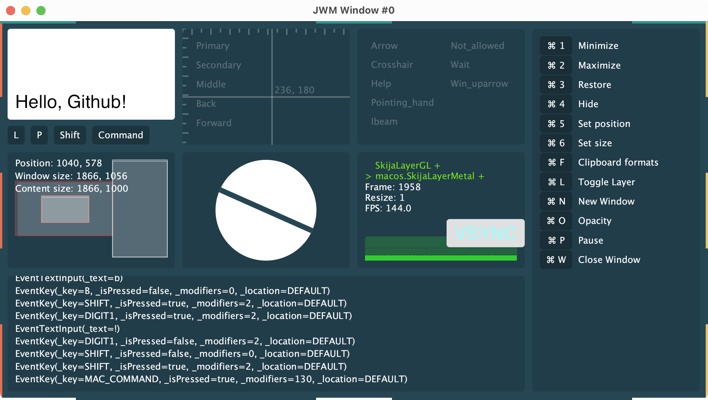

# Java Window Management library

<p align="center">
  
</p>

## Vision

JWM is a cross-platform Java window management and OS integration library.

JWM aims to expose an interface that abstracts over window creation, input handling and OS integration. It’s planned to support all the primary desktop platforms:

- Windows
- macOS
- X11
- Wayland

Primary goals:

- Native JVM API
- High-quality OS integration (indistinguishable from native apps)
- Plays well with (but does not require) [Skija](https://github.com/HumbleUI/Skija)

Motto: **“Electron for JVM, without Chrome and JS”**



## Comparison to other UI/window libraries

Traditionally, Java UIs struggled with high-quality OS integration. JWM plans to bring it to modern standards by implementing those integrations from scratch in modern low-level OS-native APIs. Prior art:

AWT:

- Bullet-proof, works everywhere
- Event loop is two-threaded (lags in UI)
- Dated font management, color management, dpi management
- No vsync

JavaFX:

- Fixed threading model
- Performance is [sometimes great, sometimes terrible](https://github.com/tonsky/java-graphics-benchmark/)
- Even more limited fonts/color/graphics API
- VSync is weird in multi-monitor case
- No real extensibility

[Winit](https://github.com/rust-windowing/winit):

- Tried at JetBrains
- Complicated event loop model (tries to unify desktop + web + mobile)
- https://github.com/rust-windowing/winit/blob/master/FEATURES.md

GLFW via LWJGL, SDL2:

- Game-oriented
- Bad window management
- No OS integration
- Create one window and go full-screen is the main use-case

Electron:

- Seems great, will use as inspiration
- https://www.electronjs.org/docs

## Dependency

Key        | Value
-----------|-----------------------
groupId    | io.github.humbleui
artifactId | jwm
version    | 

## Resources

- [Getting Started](https://github.com/HumbleUI/JWM/blob/main/docs/Getting%20Started.md)
- [Jetpack Compose on JWM](https://github.com/smallshen/JWM-Compose/)

## Status

Alpha. Expect API breakages.

### App

|                   | Windows | macOS | X11 |
|-------------------|---------|-------|-----|
| start             | ✅   | ✅   | ✅   |
| makeWindow        | ✅   | [#121](https://github.com/HumbleUI/JWM/issues/121)   | ✅   |
| getScreens        | ✅   | ✅   | ✅   |
| getPrimaryScreen  | ✅   | ✅   | ✅   |
| runOnUIThread     | ✅   | ✅   | ✅ |
| terminate         | ✅   | ✅   | ✅   |
| Show notification | ❌   | ❌   | ❌   |

### Theme
|                   | Windows | macOS | X11 |
|-------------------|---------|-------|-----|
| isHighContrast    | ✅      | ✅    | ➖  |
| isDark            | ✅      | ✅ | ➖ |
| isInverted        | [#161](https://github.com/HumbleUI/JWM/issues/161) | ✅ | ➖ |

### Window

|                     | Windows | macOS | X11 |
|---------------------|---------|-------|-----|
| setEventListener    | ✅   | ✅   | ✅   |
| setTextInputClient  | ✅   | ✅   | ✅   |
| setTextInputEnabled | ✅   | ❌   | ❌   |
| unmarkText          | ✅   | ❌   | ❌   |
| show                | ✅   | ✅   | ✅   |
| getWindowRect       | ✅   | ✅   | ✅   |
| getContentRect      | ✅   | ✅   | ✅   |
| setWindowPosition   | ✅   | ✅   | ✅   |
| setWindowSize       | ✅   | ✅   | ✅   |
| setContentSize      | ✅   | ✅   | ✅   |
| getScreen           | ✅   | ✅   | ✅   |
| requestFrame        | ✅   | ✅   | ✅ |
| close               | ✅   | [#107](https://github.com/HumbleUI/JWM/issues/107) | ✅   |
| minimize            | ✅   | ✅  |  ✅   |
| maximize            | ✅   | ✅  |  ✅   |
| restore             | ✅   | ✅  |  ✅   |
| setTitle            | ✅   | ✅   | ✅   |
| setIcon             | ✅   | ✅   | [#95](https://github.com/HumbleUI/JWM/issues/95)  |
| Set system cursor   | ✅   | ✅   | ✅  |
| Customize titlebar  | [#75](https://github.com/HumbleUI/JWM/issues/75)  | [#75](https://github.com/HumbleUI/JWM/issues/75)  | [#75](https://github.com/HumbleUI/JWM/issues/75)  |
| focus               | ✅   | ✅   | ❌   |
| Get ZOrder          | ❌   | ✅   | ❌   |
| Progress Bar        | ❌   | ✅   | ❌   |
| Set custom cursor   | ❌   | ❌   | ❌   |
| openFile            | ❌   | ❌   | ❌   |
| openFolder          | ❌   | ❌   | ❌   |
| Transparency        | ✅   | ❌   | ❌   |
| Toggle Fullscreen   | ❌   | ✅   | ✅   |
| setMinimumSize      | ❌   | ❌   | ❌   |
| setMaximumSize      | ❌   | ❌   | ❌   |
| setResizable        | ❌   | ❌   | ❌   |
| bringToFront        | ✅   | ❌   | ❌   |
| isFront             | ✅   | ✅   | ❌   |

### Events

|                         | Windows | macOS | X11 |
|-------------------------|---------|-------|-----|
| EventFrame              | ✅   | ✅   | ✅   |
| EventKey                | ✅   | ✅   | ✅   |
| EventMouseButton        | ✅   | ✅   | ✅   |
| EventMouseMove          | ✅   | ✅   | ✅   |
| EventMouseScroll        | [#115](https://github.com/HumbleUI/JWM/issues/115) | ✅   | ✅   |
| EventTextInput          | ✅   | [#105](https://github.com/HumbleUI/JWM/issues/105) | ✅   |
| EventTextInputMarked    | ✅   | ✅   | ✅   |
| EventWindowCloseRequest | ✅   | ✅   | ✅   |
| EventWindowMove         | ✅   | [#116](https://github.com/HumbleUI/JWM/issues/116) | ✅   |
| EventWindowResize       | ✅   | ✅   | ✅   |
| EventWindowMinimize     | ✅   | ✅   | [#96](https://github.com/HumbleUI/JWM/issues/96)   |
| EventWindowMaximize     | ✅   | ✅   | [#96](https://github.com/HumbleUI/JWM/issues/96)   |
| EventWindowRestore      | ✅   | ✅   | [#96](https://github.com/HumbleUI/JWM/issues/96)   |
| EventWindowVisible      | [#140](https://github.com/HumbleUI/JWM/issues/140) | [#140](https://github.com/HumbleUI/JWM/issues/140)   | [#140](https://github.com/HumbleUI/JWM/issues/140)   |
| EventWindowScreenChange | [#117](https://github.com/HumbleUI/JWM/issues/117) | [#117](https://github.com/HumbleUI/JWM/issues/117) | [#117](https://github.com/HumbleUI/JWM/issues/117) |
| EventWindowFocusIn      | ✅   | ✅   | ✅   |
| EventWindowFocusOut     | ✅   | ✅   | ✅   |
| EventWindowFullScreenEnter | ❌   | ✅   | ❌   |
| EventWindowFullScreenExit  | ❌   | ✅   | ❌   |
| Drag & Drop             | ❌   | ❌   | ❌   |
| Touch events            | ❌   | [#249](https://github.com/HumbleUI/JWM/issues/249)   | ❌   |
| Theme Changed           | ❌   | ❌   | ❌   |

### Screen

|                         | Windows | macOS | X11 |
|-------------------------|---------|-------|-----|
| id                      | ✅      | ✅    | ✅  |
| isPrimary               | ✅      | ✅    | ✅  |
| bounds                  | ✅      | ✅    | ✅  |
| scale                   | ✅      | ✅    | ✅  |
| workArea                | ✅      | ✅    | [#119](https://github.com/HumbleUI/JWM/issues/119) |
| colorSpace              | [#122](https://github.com/HumbleUI/JWM/issues/122) | [#122](https://github.com/HumbleUI/JWM/issues/122) | [#122](https://github.com/HumbleUI/JWM/issues/122) |

### Clipboard

|                | Windows | macOS | X11 |
|----------------|---------|-------|-----|
| set            | ✅      | [#51](https://github.com/HumbleUI/JWM/issues/51)   | ✅  |
| get            | ✅      | [#51](https://github.com/HumbleUI/JWM/issues/51)   | ✅  |
| getFormats     | ✅      | [#51](https://github.com/HumbleUI/JWM/issues/51)   | ✅  |
| clear          | ✅      | [#51](https://github.com/HumbleUI/JWM/issues/51)   | ✅  |
| registerFormat | ✅      | [#51](https://github.com/HumbleUI/JWM/issues/51)   | ✅  |

### Layers

|            | Windows | macOS | X11 |
|------------|---------|-------|-----|
| Raster     | ✅      | [#81](https://github.com/HumbleUI/JWM/issues/81)   | ✅  |
| OpenGL     | ✅      | ✅    | ✅  |
| DirectX 11 | ❌      | ➖    | ➖  |
| DirectX 12 | ✅      | ➖    | ➖  |
| Metal      | ➖      | ✅    | ➖  |
| Vulkan     | ❌      | ➖    | ❌  |

### Packaging

|                | Windows | macOS | X11 |
|----------------|---------|-------|-----|
| Run on GraalVM | ❌      | ❌    | ❌  |
| App package    | ❌      | ❌    | ❌  |

## Building from source

Prerequisites:

- Shared: Git, CMake(3.11+), Ninja, C++ compiler, JDK 11+, $JAVA_HOME, Python 3
- Windows 10: Microsoft Visual C++ (MSVC), x64 Native Tools Command Prompt for VS
- Ubuntu 20.04: `libxcomposite-dev libxrandr-dev libgl1-mesa-dev libxi-dev libxcursor-dev`

Run:

```
./script/build.py
```

Run examples:

```
./script/run.py
```

Run examples without building (use version from the table above):

```
./script/run.py --jwm-version <version>
```

### Local JAR

Generate & install a local .jar file:

```
./script/install.py
```

This outputs `target/jwm-0.0.0-SNAPSHOT.jar` for use in testing (e.g. `io.github.humbleui/jwm {:local/root "..."}` if using deps.edn)

### MacOS

Before running the build, ensure you've installed:
* XCode Developer Tools (`xcode-select --install`)
* Ninja (`brew install ninja`)
* Python 3 (`brew install python`)

### Debugging

Set `JWM_VERBOSE` in process env to see extra log output when running locally.

``` bash
# Mac / Linux
export JWM_VERBOSE=true

# Windows
set JWM_VERBOSE=true
```

# Contributing

PRs & issue reports are welcome!

Please read [Conventions](https://github.com/HumbleUI/JWM/blob/main/docs/Conventions.md) first.

If you are looking where to start, there’s a label: [Good first issue](https://github.com/HumbleUI/JWM/issues?q=is%3Aissue+is%3Aopen+label%3A%22good+first+issue%22).

Issues labeled “[Design](https://github.com/HumbleUI/JWM/issues?q=is%3Aissue+is%3Aopen+label%3ADesign)” and “[Not sure](https://github.com/HumbleUI/JWM/issues?q=is%3Aissue+is%3Aopen+label%3A%22Not+sure%22)” require prior discussion—leave a comment with your ideas!

# Contributors

- [Nikita Prokopov](https://github.com/tonsky)
- [Egor Orachyov](https://github.com/EgorOrachyov)
- [Alexey Titov](https://github.com/Alex2772)
- [Pavel Sergeev](https://github.com/SergeevPavel)
- [110416](https://github.com/i10416)
- [Matt Worzala](https://github.com/mworzala)
- [dzaima](https://github.com/dzaima)

Development sponsored by:

- [JetBrains](https://jetbrains.com/)
- [Roam Research](https://roamresearch.com/)
- [Clojurists Together](https://www.clojuriststogether.org/)
