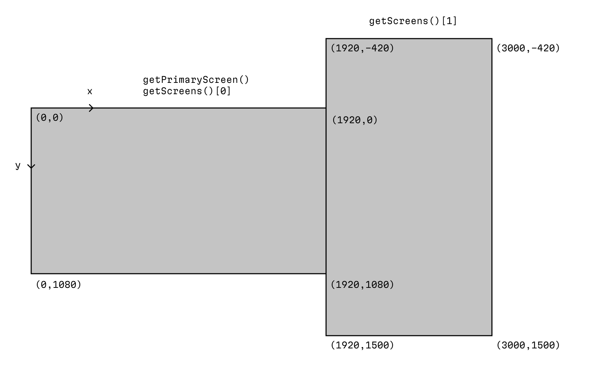
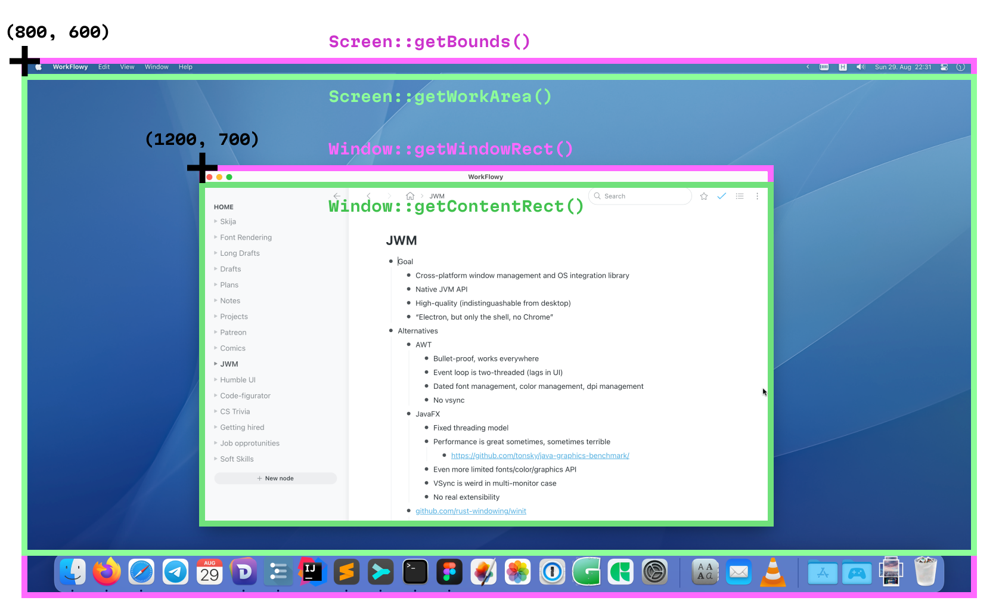

# Getting started

## Dependencies

First, add the latest version of JWM specific to your platform to the dependencies:

Key        | Value
-----------|-----------------------
groupId    | io.github.humbleui.jwm
artifactId | jwm
version    | </version>

E.g. for Maven it’ll look like this:

```xml
<dependency>
    <groupId>io.github.humbleui.jwm</groupId>
    <artifactId>jwm</artifactId>
    <version>0.2.4</version>
</dependency>
```

## Creating a window and starting an event loop

Init JWM library:

```java
App.init();
```

Create a window:

```java
Window window = App.makeWindow();
window.setTitle("Hello, world!");
```

Set up a listener:

```java
class EventHandler implements Consumer<Event> {
    public final Window window;

    public EventHandler(Window window) {
        this.window = window;
    }
}
```

Write the `accept` function:

```java
@Override
public void accept(Event e) {
    System.out.println(e);

    if (e instanceof EventWindowCloseRequest) {
        window.close();
        App.terminate();
    }
}
```

Assign handler to the window:

```java
window.setEventListener(new EventHandler(window));
```

Display the window:

```java
window.setVisible(true);
```

Start the event loop (will block the thread):

```java
App.start();
```

See it all together in [GettingStarted.java](GettingStarted.java).

## Notes on running the app

On Windows and Linux, just run:

```sh
java -cp jwm-macos-arm64.jar:jwm-shared.jar GettingStarted.java
```

On macOS, add `-XstartOnFirstThread` flag to `java`:

```sh
java -XstartOnFirstThread -cp jwm-macos-arm64.jar:jwm-shared.jar GettingStarted.java
```

## Positioning the window

You can access information about screen configuration through `App::getScreens` and `App::getPrimaryScreen`.

This will create a window that occupies the left side of the screen and is 800 px wide:

```
Screen screen = App.getPrimaryScreen();
UIRect workArea = screen.getWorkArea();
window.setWindowPosition(workArea.getLeft(), workArea.getTop());
float scale = screen.getScale();
window.setWindowSize(800 * scale, workArea.getHeight());
```

All screen coordinates are in one absolute coordinate space. Top left corner of the primary screen usually has (0, 0) coordinate:



All pixel sizes are also unscaled. They correspond to the physical screen pixels, not “logical” pixels. Note: this is similar to how Windows/Linux work but opposite of what macOS does. JWM abstracts that difference away for you.

To convert “logical” pixels to physical one, multiply by `Screen::getScale()`. E.g. if you want 800×600 window on macOS, do:

```
float scale = window.getScreen().getScale();
window.setWindowSize(800 * scale, 600 * scale);
```

Window position is specified in the same absolute coordinate space. E.g. to move window to another screen just do `Window::setPosition` to a coordinate within that screen bounds:



## Handling mouse events

```java
@Override
public void accept(Event e) {
    if (e instanceof EventMouseMove ee) {
        // ee.getX() / ee.getY() for window-relative coordinates
    } else if (e instanceof EventMouseScroll ee) {
        // ee.getDeltaX() / ee.getDeltaY() for amount of text lines to scroll
        // See #115
    } else if (e instanceof EventMouseButton ee) {
        // ee.getButton() + ee.getPressed()
    }
}
```

## Handling keyboard events

Simple key handling (e.g. for program shortcuts) via `EventKey`.
Simple text input via `EventTextInput`.
Advanced text input (IME) via `EventTextInputMarked` + `TextInputClient`. See [PanelTextInput.java](https://github.com/HumbleUI/JWM/blob/main/examples/java/PanelTextInput.java) for hints how to handle IME input.

```java
@Override
public void accept(Event e) {
    if (e instanceof EventKey ee) {
        // ee.getKey() + ee.isPressed() for raw keyboard keys
        // Do not use this for text input
    } else if (e instanceof EventTextInput ee) {
        // ee.getText() for text string entered
    } else if (e instanceof EventTextInputMarked ee) {
        // ...
    }
}
```

## Render loop

JWM drawing loop is on-demand and always v-synced with monitor refresh rate (except rare cases like raster rendering on X11). To draw a frame, you first post a frame request:

```java
window.requestFrame();
```

Note that if you do it not from the UI thread (== not from `accept` method of EventHandler), use `App::runOnUIThread` to get to UI thread first:

```java
App.runOnUIThread(() -> window.requestFrame());
```

Then, in `accept` method handle `EventFrame`:

```java
@Override
public void accept(Event e) {
    if (e instanceof EventFrame) {
        paint(window);
    }
}
```

This will render just one frame. If you want to render in a loop (e.g. for an animation or for a game), you can request next frame right after paint:

```java
@Override
public void accept(Event e) {
    if (e instanceof EventFrame) {
        paint(window);
        window.requestFrame();
    }
}
```

## Layers

Now, JWM does not provide anything to actually _draw_ stuff. You can use other libraries, e.g. [Skija](https://github.com/jetbrains/skija), to do that. But JWM provides Layers to initilize graphical context and get all the necessary pointers to use with DirectX 12, OpenGL or Metal.

Let’s write a simple `paint` function that initializes OpenGL and uses it to draw. First, let’s create a layer and `attach` it:

```java
class EventHandler implements Consumer<Event> {
    public final Window window;
    public final LayerGL layer;

    public EventHandler(Window window) {
        this.window = window;
        layer = new LayerGL();
        layer.attach(window);
    }
}
```

Now, we need to handle `EventWindowScreenChange` and `EventWindowResize` and tell layer to resize itself so that its backing texture will match screen pixels:

```java
@Override
public void accept(Event e) {
    if (e instanceof EventWindowScreenChange) {
        layer.reconfigure();
        UIRect contentRect = window.getContentRect();
        layer.resize(contentRect.getWidth(), contentRect.getHeight());
        paint();
    } else if (e instanceof EventWindowResize ee) {
        layer.resize(ee.getContentWidth(), ee.getContentHeight());
        paint();
    }
}
```

Then, if the paint request comes, we need to redirect it to the paint function:

```java
@Override
public void accept(Event e) {
    if (e instanceof EventFrame) {
        paint();
        window.requestFrame();
    }
}
```

And finally, we write the paint function itself:

```java
public void paint() {
    layer.makeCurrent();
    // do the drawing
    layer.swapBuffers();
}
```

For details on [Skija](https://github.com/jetbrains/skija) integration, consult `SkijaLayer*.java` in [examples](https://github.com/HumbleUI/JWM/tree/main/examples/java/) folder.