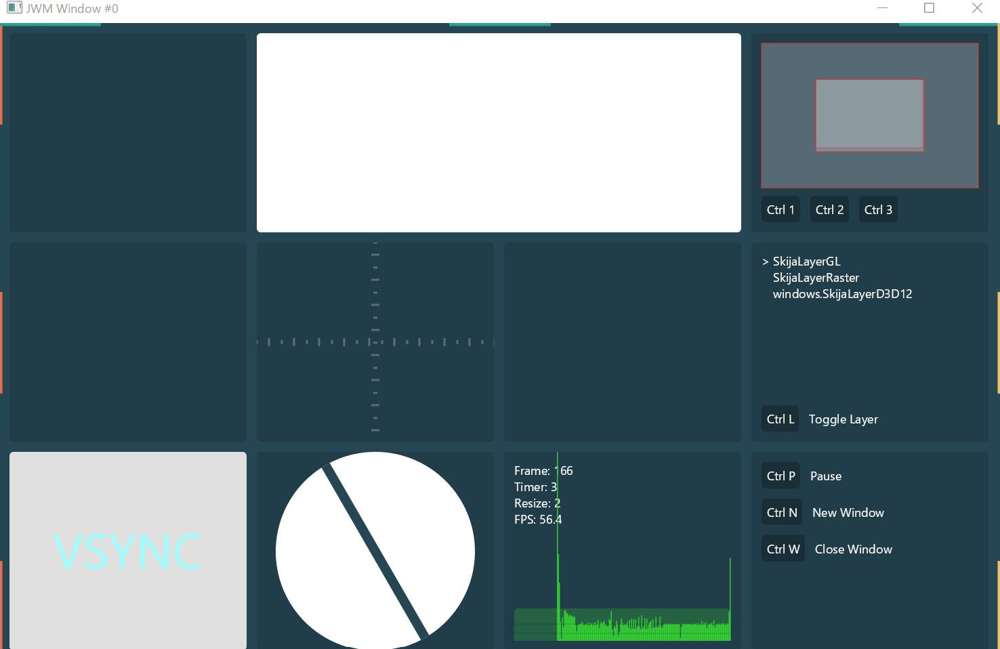

## Building from source (and run example app) on Windows

```sh
git clone git@github.com:HumbleUI/JWM.git
cd JWM
```

Prerequisites:

- Build:
  - Git,  Python 3, Ninja, JDK 11+, $JAVA_HOME, MSVC build tools
- Run example App:
  - [JDK 16](https://jdk.java.net/16/)


## Install Python 3

from windows power shell

```sh
winget install Python.Python.3
```

or from chocolatey
```sh
choco install -y python
```

You'll need to ensure your Java installation's `$JAVA_HOME/bin` is on your system PATH. This exposes necessary interop codefiles like `jni.h` to the compiler. Your JAVA bin path will look similar to "`C:\Program Files\Java\jdk-17.0.2\bin`"

## Install Ninja

Download executable from https://github.com/ninja-build/ninja/releases and export path.

## Install visual studio build tools

Run this command in windows power shell.

```sh
winget install Microsoft.VisualStudio.2019.BuildTools
```

Then, run `C:\Program Files (x86)\Microsoft Visual Studio\Installer\setup.exe` and install c++ development tools.

After reboot, open one of the command prompts for VS 2019 matching your arch.

For a standard 64-bit build, try the VS `x64` command prompt, usually located at `C:\path\to\Start Menu\Programs\Visual Studio 2019\Visual Studio Tools\VC`.

### Configure path and env (optional)

If you want to use visual studio build tools from another shell like [git bash](https://gitforwindows.org/), export these environment variables.

NOTE: Change paths, architecture(arm,x64,x86) and visual studio version according to your environment.

INCLUDE

- C:\Program Files (x86)\Microsoft Visual Studio\2019\BuildTools\VC\Tools\MSVC\14.29.30133\include
- C:\Program Files (x86)\Windows Kits\10\Include\10.0.19041.0\ucrt
- C:\Program Files (x86)\Windows Kits\10\Include\10.0.19041.0\shared
- C:\Program Files (x86)\Windows Kits\10\Include\10.0.19041.0\cppwinrt
- C:\Program Files (x86)\Windows Kits\10\Include\10.0.19041.0\um
- C:\Program Files (x86)\Windows Kits\10\Include\10.0.19041.0\winrt

LIB

- C:\Program Files (x86)\Windows Kits\10\Lib\10.0.19041.0\ucrt\x64
- C:\Program Files (x86)\Windows Kits\10\Lib\10.0.19041.0\ucrt_enclave\x64
- C:\Program Files (x86)\Windows Kits\10\Lib\10.0.19041.0\um\x64
- C:\Program Files (x86)\Microsoft Visual Studio\2019\BuildTools\VC\Tools\MSVC\14.29.30133\lib\x64

PATH
- C:\Program Files (x86)\Windows Kits\10\bin\10.0.19041.0\x64
- C:\Program Files (x86)\Microsoft Visual Studio\2019\BuildTools\Common7\IDE\CommonExtensions\Microsoft\CMake\CMake\bin
- C:\Program Files (x86)\Microsoft Visual Studio\2019\BuildTools\VC\Tools\MSVC\14.29.30133\bin\Hostx64\x64
- C:\path\to\ninja

## Build and run example app
To run example application, you need  [JDK 16](https://jdk.java.net/16/).


```sh
# from command prompt for vs
python script\build.py
python script\run.py

# In unix-like shell,
python ./script/build.py
python ./script/run.py
```
You will get something like this.



## Troubleshooting
- disable other c++ compilers like minGW
- try removing windows/build directory and re-run command
- run `python ./script/clean.py`
- check environment variables and paths (`echo`, `where <cmd>` in power shell or `which <cmd>` in unix-like shell)
